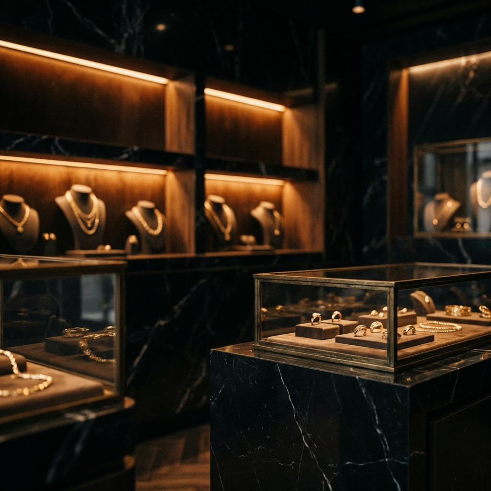

# Acharya Jewel - Timeless Elegance

**Acharya Jewel** is a premium jewelry website landing page designed to gaze at the intersection of tradition and modern luxury. This project showcases a "Shop By Category" section with a high-end, dark-themed aesthetic inspired by top jewelry brands like Tanishq.



## 💎 Features

*   **Hero Section**: captivating parallax header with a call to action.
*   **Shop By Category**: A grid of 6 distinct jewelry categories (Gold, Diamond, Earrings, Rings, Necklaces, Bracelets) featuring:
    *   Custom-generated high-resolution jewelry imagery.
    *   Smooth hover effects and micro-interactions.
    *   Glassmorphism and gradient overlays for a premium feel.
*   **Features Section**: Highlighting the brand's core values (Authentic Gold, Custom Design, Lifetime Support).
*   **Responsiveness**: Fully responsive design adapting to mobile and desktop screens.
*   **Aesthetic**: Dark mode interface with Gold (#D4AF37) accents for a royal look.

## 🛠️ Technologies Used

*   **HTML5**: Semantic structure.
*   **CSS3**: Custom styling, CSS Grid/Flexbox, Animations, Media Queries.
*   **Google Fonts**: Playfair Display (Headings) and Montserrat (Body).

## Live Link
[Visit Acharya Jewel](https://tanviacharya1712.github.io/Frontend-Acharya-Jewel/)
## 📂 Project Structure

```
Frontend-Acharya-Jewel/
├── index.html          # Main HTML structure
├── style.css           # Global styles and responsive design
├── hero-bg.png         # Hero background asset
├── cat_*.png           # Category images (Gold, Diamond, etc.)
└── README.md           # Project documentation
```


